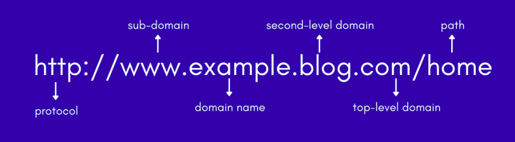
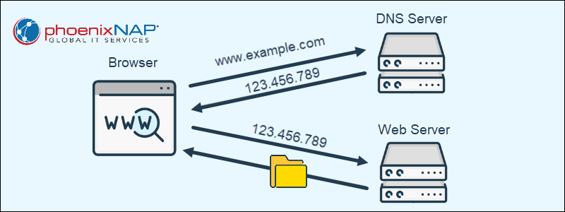

<link rel="preconnect" href="https://fonts.googleapis.com">
<link rel="preconnect" href="https://fonts.gstatic.com" crossorigin>
<link href="https://fonts.googleapis.com/css2?family=Single+Day&display=swap" rel="stylesheet">

👉 [internet-basics](#🌐-internet-basics) 〰️ [url-components](#🔗-components-of-the-url) 〰️ [protocols](#📄-http-and-https) 〰️ [ip-adresses](#🖥️-ip-adresses) 〰️ [dns](#📖-dns) 〰️ [mark-down](#📃-mark-down) 〰️ [local-remote-repos]()
# 🌐 Internet Basics 

- What is the <u>**Internet**</u>?
- What is <u>**URL**</u> (**U**niform **R**esource **L**ocator and also known as web adress)?

**What happens when we are entering a URL in browser?**
1. Your browser sends request when we enter adress in the adress bar and hit enter to go. And it's always a GET request.  
2. A server thet recive this request after processing it, it send back a response.  
3. Server that is sending back the information or response or recourse is called a web server.  

- You always have a client and server. 
- The communication that is happening is using <u>**HTTP**</u> (**H**ypertext **T**ransfer **P**rotocol) protocol.  
- What is <u>**Protocol**</u>? It's a set of rules  
- What is <u>**Hypertext**</u>? It's a text that contains links to other texts. 

# 🔗 Components of the URL 

- Query (`?` mark ) 
- Parameters starting after the `?` mark (like color=black)
    - sub directory
    - slug (end page that we want to access)
     

# 📄 HTTP:// and HTTPS://

- <u>**HTTP**</u> is simply the **H**ypertext **T**ransfer **P**rotocol
- HTTPS is exactly http but secure 
- `s` at the end of http refers to SSL/TLS
- In HTTPS protocol first handshake is done between Client and Server and they choose a secret language to communicate with each other. So any third person or hacker can not understand their communication.
 

# 🖥️ IP Adresses 

An <u>**I**nternet **P**rotocol</u> (**IP**) address is the unique identifying number assigned to every device connected to the internet. An IP address definition is a numeric label assigned to devices that use the internet to communicate.  
 - Google IP adress http://172.217.16.78  
 - Each part cintains a number from 0-255  
 - Each part is separated with `.`  
 - Above one is actually IPv4 adress  
- But nowdays IPv6 we are also using IPv6 adress  
 - IPv6 looks like `2001:0db8:85a3:0000:0000:8a2e:0370:7334.`
 

 # 📖 DNS

The <u>**D**omain **N**ame **S**ystem</u> (**DNS**) turns domain names into IP addresses, which browsers use to load internet pages.
 

# 📃 Mark-down
- How do we Bold some text?
    By adding `**` at start and at the end of the text.
- How to write a link in Markdown?
    `[title of the link](# Link itself)`
    [IP Adress](#🖥️-ip-adresses)
- Adding an external sourse:
    `[title of the link](# Link itself - URL)`
- How to include an image inside a markdown?
    ``
- [Emoji Cheat Sheet](https://GitHub.com/ikatyang/emoji-cheat-sheet/blob/master/README.md)

# 📁 Local and Remote Repositories 
Local repositories reside on the computers of team members. In contrast, <u>remote</u> repositories are hosted on a server that is <u>accessible for all team members</u> - most likely on the internet or on a local network.

 For remote repositories we will use <u>GitHub</u>.

 # 🗂️ Creating a Repo on GitHub
<u>What is the GitHub:</u>

    It's a portal that provides us option to create a remote repo, like gitlab and others.
    
Followed by such steps we'll <u>create a repo on GitHub</u>:

- register and login into github.
- go to your account /menu and then select and then select repositories.
- then select the `new` in repo.
- select owner of the repo.
- provide a name, w/o spaces.
- then click the `create repository` 

    P.S. there's <u>two ways of creating</u> the remote repo:
    - SSH (just copy the link of the repo from quick setup option.)
    - HTTP  

- to clone the repo from GitHub we need to run the command `git clone copied-link-from-github` , after cloning the repo from GitHub, a folder will be created with the name of the repo
- after cloning the repo from GitHub, a folder will appier with the name of the repo
- open that folder via VS code
- make your changes like adding a new file/folder modifying a file
- we need to make our changes ready 

to <u>get a latest version</u> of a remote repo:
`git pull`

to <u>commit into a remote repo</u> we gotta:
`git add .`
`git commit -m "comment to a commit"`
`git push`

    
